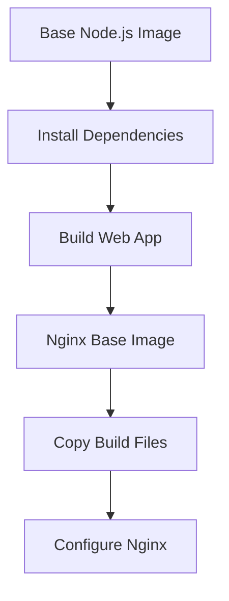
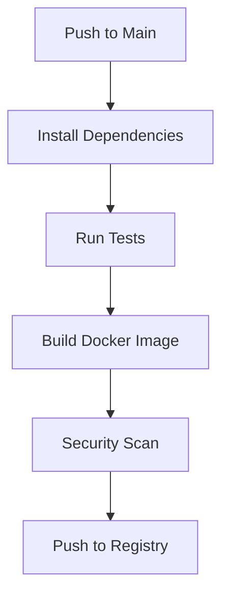

# Decision Log

2025-04-13 12:47:40 - Container and CI/CD Implementation Plan

## Decision
Implement containerization and CI/CD pipeline for the Expo React Native web application.

## Rationale
- Need for consistent deployment environment
- Automated build and deployment process
- Production-ready configuration with Nginx
- Scalable and maintainable infrastructure

## Implementation Details

### 1. Dockerfile Implementation

#### Steps:
1. Create multi-stage Dockerfile
   - Stage 1: Build environment
   - Stage 2: Production environment
2. Configure Nginx for SPA support
3. Implement build optimizations

### 2. GitHub Actions Pipeline

#### Steps:
1. Create GitHub Actions workflow
2. Set up Docker registry secrets
3. Implement build caching
4. Add security scanning
5. Configure deployment triggers

### 3. Security Considerations
- Use specific version tags for base images
- Implement least privilege principle
- Regular security updates
- Dependency scanning

### 4. Optimization Strategies
- Multi-stage builds
- Layer caching
- Build artifact optimization
- Nginx performance tuning

## Next Actions
1. Create Dockerfile
2. Set up GitHub Action workflow
3. Configure Nginx
4. Implement security measures
5. Test deployment process