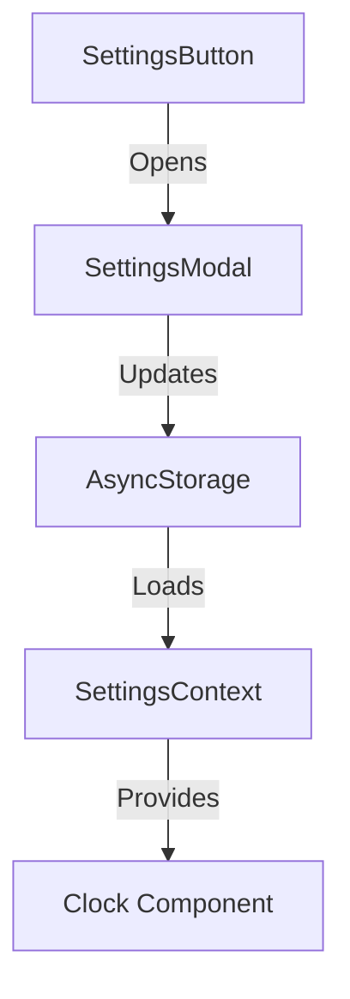

# Product Context

This file provides a high-level overview of the project and the expected product that will be created. Initially it is based upon projectBrief.md (if provided) and all other available project-related information in the working directory. This file is intended to be updated as the project evolves, and should be used to inform all other modes of the project's goals and context.
2025-04-12 16:56:30 - Settings Feature Implementation Plan

## Project Goal
Implement a configurable timer settings feature that allows users to customize the countdown duration through a settings modal accessible via a button in the top-left corner.

## Key Features

### Settings Button & Modal
* Position: Top-left corner
* Functionality: Opens settings modal
* Visual: Uses existing icon library
* Accessibility: Full keyboard and screen reader support

### Timer Configuration
* Configurable duration
* Persistent storage of settings
* Real-time updates to timer
* Input validation and error handling

## Overall Architecture

### Component Structure


### Technical Stack
* React Context API for state management
* AsyncStorage for settings persistence
* Modal component from react-native
* Existing icon library for UI elements

### Data Structure
```typescript
interface Settings {
  timerDuration: number; // in minutes
}
```

### Implementation Phases

#### Phase 1: Setup & Foundation
* Install dependencies
* Create SettingsContext
* Implement persistence service
* Add type definitions

#### Phase 2: UI Components
* SettingsButton (top-left position)
* SettingsModal with duration input
* Input validation
* Styling integration

#### Phase 3: Integration
* Connect components
* Wire up context
* Implement persistence
* Update Clock component

#### Phase 4: Testing & Polish
* Unit tests for settings logic
* Integration tests
* E2E testing
* Documentation updates

### File Structure
```
components/
├── settings/
│   ├── SettingsButton.tsx
│   ├── SettingsModal.tsx
│   └── __tests__/
context/
└── SettingsContext.tsx
services/
└── settings.ts
```

2025-04-12 16:56:30 - Initial plan documented.